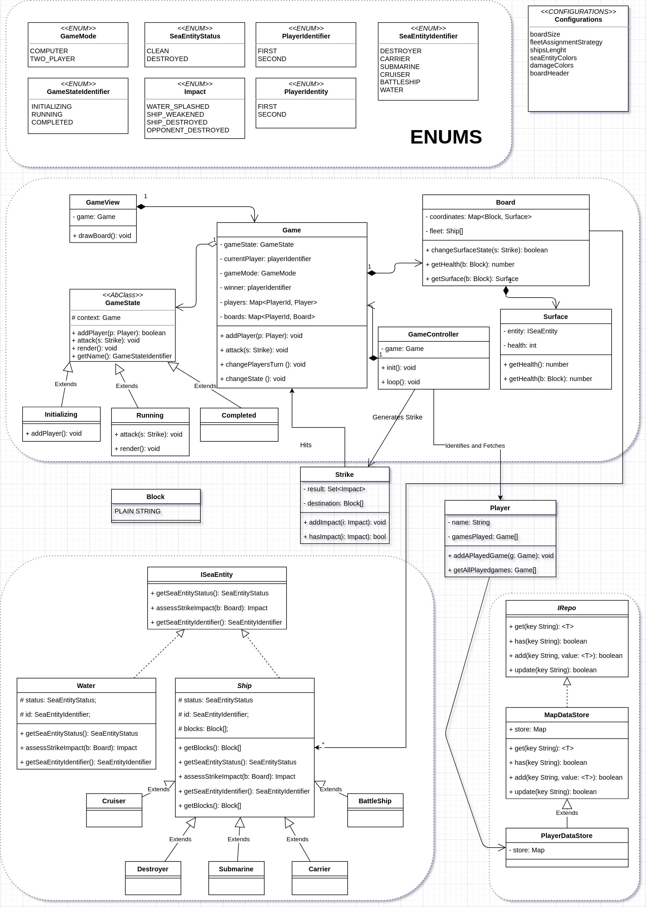
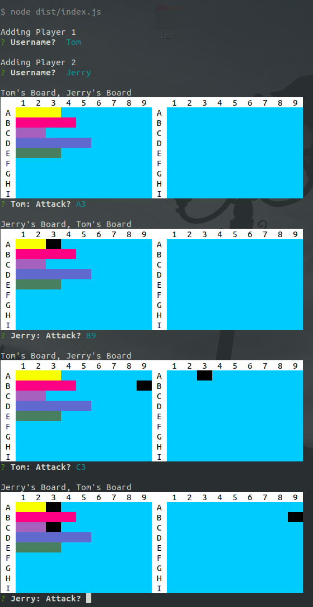

### Problem Statement
Design the [battleship game](https://en.wikipedia.org/wiki/Battleship_(game)) for 2 people playing on the same computer

#### Rules of the game
1. Each Person has two boards, one where he places his own ships, one where
he tracks the missiles he has fired. Each board is of size 10x10
2. Each person can place 5 ships on his board
    * Carrier of length 5
    * Battleship of length 4
    * Cruiser of length 3
    * Submarine of length 3
    * Destroyer of length 2
3. Players take turn to fire missiles at the opposing player. If the missile hits a ship, then the opposing player informs the initial mover of a hit, else he says it’s a miss. If all the spots on a ship are hit, then the ship is sunk.

### Approach
I have broken down the complete problem in majorly following parts
* Game Engine
* Sea Entities
* Data Store
* Destruction Mechanism

A detail class diagram is as follows:

### Code Execution
The code is written in typescript. Attached is the build folder. 

It can be executed by issuing 
`yarn start`

##### Running Screenshot

### Useful Libraries
* [Colored Terminal Display](https://www.npmjs.com/package/chalk)
* [Terminal Prompt](https://www.npmjs.com/package/inquirer)
